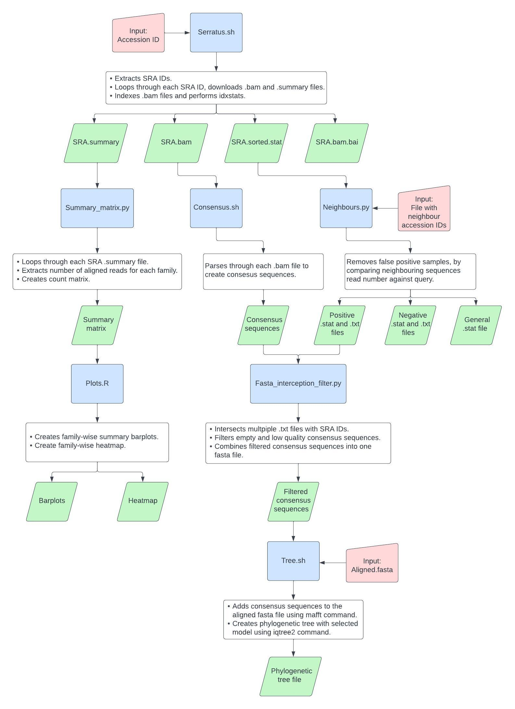

# Overview
The overall analysis of this study consists of two parts. Analysis of the UnXplore dataset was performed using one custom made bash script, whereas Serratus dataset was analysed using three bash, three python and one R script. 

# UnXplore
The `UnXplore.sh` script requires two positional inputs from the user - a FASTA file with genomic sequency query, and a FASTA file with assembled contigs for a local database creation. It works by first generating a local nucleotide BLAST database using 'makeblastdb' command from NCBI BLAST suite of programs. Once the database is created, the query sequence is seached using 'bastn' command. The results displayed in a text file in a default BLASTN tabular output format 6. Both results and generated databases are saved in `../UnXplore` directory under specific subdirectories. The script creates all required directories automatically.
To run the script the user just simply inputs query FASTA sequence as a first argument, and contig FASTA file as a second:
```
bash UnXplore.sh <query> <database>
```
The required aligned contig datasets are public available in Modha et al., 2022 study. Due to the sheer size (300b long contig file requires over 80GB of space), the dataset was not included.

The paper: Modha, S., Robertson, D.L., Hughes, J. and Orton, R.J. (2022). Quantifying and Cataloguing Unknown Sequences within Human Microbiomes. mSystems. doi:https://doi.org/10.1128/msystems.01468-21.


# Serratus
The overall workflow for analysing Serratus (www.serratus.io) database is outlined below. It consists of downloading a Serratus summary file for an entered GenBank ID, followed by an extraction of the SRA sample accession IDs which are used to download corresponding SRA summary and BAM files. These files contain reads that were mapped to the pangenome of viral sequences as well as a text overview of number of reads mapping to different viral taxonomic families. These SRA summary files are used to create a family count summary matrix, which are subsequently analysed and visualised. Other steps include neighbourhood filtering, generation of consensus sequences, low quality sequences filtering, their alignment to study sequences and phylogenetic tree analysis. Documentation how to run each script, how it works, and recommended order is described below:



## Script documentation:
```
bash Serratus.sh <Accession ID>
```
`<Accession ID>` -is a positional argument that intakes GenBank ID (i.e., NC_001401.2).

The main purpose of this script is to download Serratus BAM and summary files, according to a given genome sequence GenBank ID that is available in Serratus database. The script downloads a general summary file, which contains SRA matches which have alignment identity higher than 75% and score higher than 50%. Then, for each SRA match, it downloads a corresponding BAM and its summary file using ‘wget’ command. BAM files get indexed with ‘samtools index’ command and then ‘samtools idxstats’ is used to generate .sorted.stat file that displays number of hits to each viral genome, which is sorted in descending order. All the results are saved in `../Serratus/<Accession ID>/Data/` directory, which is created automatically.


```
python3 Summary_matrix.py <Accession ID> -output [output] -filter [filter] -sra [sra]
```
`<Accession ID>` - a positional argument that specifies working directory (i.e., NC_001401.2).

`[output]` – an optional argument for specifying output prefix name (default=’Summary_matrix).

`[filter]` – an optional argument for specifying cutoff filter for number of aligned reads (default=100).

`[sra]` -an optional argument that intakes a .txt file with a list of SRA IDs (uses all SRA matches by default).


The script parses through BAM summary files to generate viral family read count matrix that is later used for co-occurrence analysis. The user specifies GenBank ID to access its BAM summary files, which are used to extract the number of hits to each viral family and are parsed to create a summary count matrix. In addition, it includes only those families that have a higher number of reads than the specified filter value.


```
R --vanilla --slave --args <Accession ID> <Virus name> [Filter value] [Summary file] < Plots.R
```
`<Accession ID>` - a positional argument that specifies working directory (i.e., NC_001401.2).

`<Virus name>` - a positional argument that specifies the name of the virus that is used for labelling purposes (i.e., AAV2).

`[Filter value]` – an optional positional argument that specifies a cutoff filter value for number of aligned reads (default=100).

`[Summary file]` – an optional positional argument that specifies summary file location, starting from specified working directory (default=Summary_matrix.csv).

The script uses generated summary count matrix for co-occurrence analysis. It creates two barplots using ‘ggplot2’ that show number of samples and total number of reads for each family. It also generates a heatmap using ‘ComplexHeatmap’ library that is used for visual representation of the matrix, as well as for family clustering analysis.


```
bash Consensus.sh <Accession ID>
```
`<Accession ID>` - a positional argument that specifies working directory (i.e., NC_001401.2).

The script generates consensus sequences for each SRA sample for the user provided GenBank ID. It works by generating text pileup output for each SRA BAM file using ‘samtools mpileup’ command, which is then piped into ‘ivar consensus’ command which generates consensus sequence that are saved in `../Serratus/<Accession ID>/Consensus/ directory`.


```
python3 Neighbours.py <Accession ID> -query <query> -output <output> -neighbours_file <neighbours_file>
```
`<Accession ID>` - a positional argument that specifies working directory (i.e., NC_001401.2).

`<query>` – a required argument that intakes GenBank ID as a query (i.e., NC_001401.2).

`<neighbours_file>` - a required argument that intakes a .txt file with neighbouring GenBank IDs.

`<output>` - a required argument that intakes output prefix name (i.e., AAV2).


Due to the nature of sequencing error, biological artifacts and mis-mapping, a small fraction of reads is assigned to related sequences in Serratus database, which sometimes have higher read count than the original sequence. This script filters them out, by parsing through each SRA .sorted.stat file and comparing if the query sequence has a higher read count than the neighbouring sequences. For this script to work, the user must manually create a .txt file that contains GenBank IDs of the neighbouring sequences. For AAV2 the viral neighbour sequences are other adeno-associated viruses AAV1, AAV3, AAV4, AAV5, AAV6, AAV7 and AAV8, while for the HAdV-F the neighbour sequences are those closely related to the human adenoviruses HAdV-A, HAdV-B, HAdV-C, HAdV-D, HAdV-E and HAdV-54. The script generates five output files – a general .stat file that displays information on how many samples passed and failed the filter, as well as neighbouring sequence IDs that were used, .stat and .txt files with SRA IDs for positive samples that passed the filter, and .stat and .txt files with SRA IDs for negative samples that did not pass the filter.


```
python3 Fasta_intersection_filter.py <Accession ID> -files <files> -perc [perc] -output [output]
```
`<Accession ID>` - a positional argument that specifies working directory (i.e., NC_001401.2).

`<files>` - a required argument that intakes .txt files with SRA IDs for intersection.

`[perc]` – an optional argument that takes percentage value for filtering consensus sequences (default=50).

`<output>` - a required argument that intakes output prefix name.


The script intakes one or more .txt files with SRA IDs to create their intersection, which is used for filtering out low quality consensus sequences that will be later used for phylogenetic tree analysis. In this case, a positive SRA ID .txt file was used that was generated after filtering out neighbouring sequences. The script functionality allows user to input multiple .txt files, in which case their SRA IDs are intersected and used for further filtering. If only one file is provided, the script uses it to filter out low quality consensus sequences, which are defined as empty sequences or those that have a higher percentage of missing bases than specified by the user. All filtered consensus sequences are combined into one FASTA file.


```
bash tree.sh <Accession ID> <fasta_file> <alignment_file> <output> <model>
```
`<Accession ID>` - a positional argument that specifies working directory (i.e., NC_001401.2).

`<fasta_file>` - a positional argument that intakes FASTA file with filtered consensus sequences.

`<alignment file>` - a positional argument that intakes aligned FASTA files.

`<output>` - a positional argument that specifies output name.

`<model>` a positional argument that specifies model (‘TIM+F+R3’ for AAV2, ‘K2P+R2’ for HAdV-F).

The FASTA alignment files were provided by Dr. Richard Orton that were obtained from the Ho et al., 2022 study. The script takes consensus sequences and aligns to the alignment file using ‘mafft’ command. The final alignment file is then used by ‘iqtree2’ to generate a phylogenetic tree with a specified model. The phylogenetic tree was analysed using FigTree software.

### Summary:
The Serratus workflow was performed for GenBank IDs `NC_001401.2` and `NC_001454.2`, which correspond to Adeno-associated virus 2 (AAV2) and Human adeno virus F (HAdV-F), respectively. The neighbour files for AAV2 and HAdV-F with their neighbour sequence GenBank IDs are available in [aav2_neighbours](Data/aav2_neighbours.txt) and [hadvf_neighbours](Data/havf_neighbours.txt), respectively.

The alignment sequences from the studies used for phylogenetic tree generation are availabe in `Data/paper_aav2_alignment.fasta` and `Data/hadv41_align.fasta` for AAV2 and HAdV-F respectively.

All the scripts create required subdirectories automatically and inform user through the terminal where all the data is saved. Finally, the script is versatile and should work with any other sequences of interest that are available on Serratus database.
